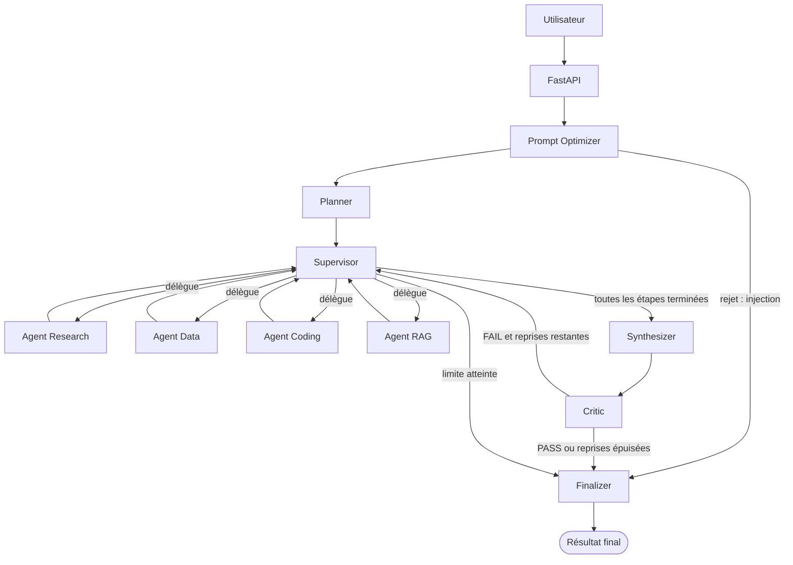

# AI Engineering Multi-Agent Platform

Plateforme d'orchestration multi-agents pensée pour la production : un workflow **LangGraph**
dans lequel un optimiseur de prompt et un planificateur structurent la demande, un
**superviseur** confie les étapes du plan à des agents spécialisés (recherche, données, code,
RAG) qui utilisent des **outils soumis à permissions**, puis un **critique** relit la réponse
synthétisée et déclenche des reprises bornées. La connaissance provient d'un **RAG hybride sur
PostgreSQL + pgvector** ; chaque exécution est tracée, budgétée et isolée par tenant.

> Fonctionne de bout en bout **sans clé d'API ni base de données** (stockage en mémoire et
> simulateur hors ligne déterministe), ainsi qu'avec Claude ou n'importe quel endpoint
> compatible OpenAI et PostgreSQL sous Docker.

## Problème

Un appel unique à un LLM ne transforme pas de façon fiable une demande métier floue (« ajoute
un système de devis à notre SaaS ») en un livrable sourcé et relu. Ce projet montre comment
en faire un système : des sorties structurées plutôt que du texte libre, des plans explicites,
des outils au moindre privilège, une recherche documentaire avec citations, un contrôle
qualité, des limites strictes sur les boucles et les coûts, et de l'observabilité.

## Architecture



Le graphe exact est généré à partir du graphe LangGraph compilé :
`uv run python -m app.cli --graph`.

| Couche | Rôle |
|---|---|
| `app/api` | routes FastAPI (fines), authentification, limitation de débit, identifiants de requête, taille maximale des corps |
| `app/services` | cas d'usage : tâches, runs (exécution en arrière-plan), évaluation |
| `app/orchestration` | état typé, graphe, nœuds, routeurs, limites et budget, exécuteur |
| `app/agents` | optimiseur, planificateur, politique du superviseur, 4 agents d'exécution, synthétiseur, critique |
| `app/llm` | types indépendants du fournisseur, adaptateurs Anthropic / compatible OpenAI / hors ligne, schémas stricts, boucle de réparation, tarification, comptage |
| `app/rag` | nettoyage, découpage, détection d'injection, embeddings, recherche hybride, reclassement |
| `app/tools` | registre et permissions, calculator, knowledge_search, task_lookup, database_read/write |
| `app/db` | modèles SQLAlchemy, repositories, migration Alembic (pgvector, RLS) |
| `app/observability` | flux d'événements → base, logs JSON, Langfuse optionnel |
| `app/evaluation` | jeu de données, évaluateurs, métriques, exécuteur |

## Stack technique

Python 3.12 · FastAPI · Pydantic v2 / pydantic-settings · LangGraph 1.x · SQLAlchemy 2 (async) +
asyncpg · Alembic · PostgreSQL 17 + pgvector · SDK Anthropic · SDK OpenAI · Langfuse (optionnel) ·
pytest / pytest-asyncio / httpx · Ruff · mypy (strict) · uv · Docker / Compose · GitHub Actions.

## Agents

| Agent | Mission | Outils | Sortie |
|---|---|---|---|
| Prompt Optimizer | demande floue → spécification vérifiable ; bloque les injections à haut risque **avant tout appel au LLM** | — | `PromptSpec` |
| Planner | spécification → DAG d'étapes (validé : identifiants uniques, dépendances connues, pas de cycle, ≤ MAX_PLAN_STEPS) | — | `Plan` |
| Supervisor | politique déterministe sur le DAG ; choix LLM optionnel **validé par la politique** | — | `SupervisorDecision` |
| Research | rassemble des éléments de preuve | knowledge_search, task_lookup, calculator | `ResearchReport` |
| Data | analyse les données de la plateforme | database_read, calculator, (database_write, sur autorisation explicite) | `DataAnalysis` |
| Coding | proposition de conception — ni shell, ni fichiers | knowledge_search | `CodeProposal` |
| RAG | réponse sourcée ; citations vérifiées mot pour mot | (moteur de recherche) | `RagAnswer` |
| Synthesizer | fusionne les résultats des étapes | — | `FinalDraft` |
| Critic | relit au regard des critères d'acceptation ; une politique codée ne peut que durcir son verdict | — | `Review` |

## Orchestration (LangGraph)

* `GraphState` typé (TypedDict de valeurs Pydantic) avec des réducteurs pour les historiques
  (`agent_results`, `tool_results`, `retrieved_documents`, `reviews`, `errors`, `messages`).
* Le graphe est compilé une seule fois ; les dépendances propres à un run (tenant, budget,
  traceur, outils) sont injectées via le contexte d'exécution de LangGraph.
* Chaque agent d'exécution ne reçoit **que** son étape, les critères d'acceptation et les
  résultats des étapes dont il dépend.
* FAIL du critique → reprise ciblée des étapes signalées **et de celles qui en dépendent** (ou
  nouvelle synthèse si seule la synthèse est en cause), dans la limite de `MAX_AGENT_RETRIES`.
* Limites appliquées deux fois : en douceur par le superviseur, strictement à chaque appel
  d'agent et de LLM : `MAX_AGENT_STEPS`, `MAX_AGENT_CALLS`, `MAX_AGENT_RETRIES`,
  `MAX_STEP_ATTEMPTS`, `MAX_TOOL_CALLS_PER_AGENT`, `MAX_RUN_SECONDS`, `MAX_RUN_COST_USD` (plus la
  limite de récursion de LangGraph).

## RAG

`nettoyage (caractères invisibles) → découpage (par paragraphes, avec recouvrement) → détection
d'injection par chunk → embedding (titre + chunk) → PostgreSQL (vector(512) HNSW + tsvector GIN
+ métadonnées JSONB)`. Requête : embedding + mots-clés → recherche vectorielle ∥ recherche
plein texte → **fusion RRF** → exclusion des chunks à haut risque → reclassement lexical →
top-k avec des étiquettes de source stables `[S1]…`. L'agent RAG répond sans appeler le LLM
quand rien de pertinent n'est trouvé, et rejette les citations qui ne figurent pas mot pour mot
dans la source.

## Appels d'outils

Chaque outil = nom, description, modèle d'entrée Pydantic (→ schéma JSON strict), permission
(`read`/`write`), délai maximal, fonction. Chaque appel passe par : l'outil existe → il est dans
la liste autorisée de l'agent → autorisation explicite pour l'écriture (`allow_tool_writes`) →
validation des arguments → délai maximal → troncature → trace. Les refus sont renvoyés au
modèle comme des erreurs et enregistrés. `database_read` n'expose que des requêtes fixes et
paramétrées — jamais de SQL brut.

## Sécurité

Clés d'API stockées sous forme d'empreintes SHA-256 · isolation des tenants dans le code **et**
par RLS PostgreSQL (forcée, rôle non superutilisateur, fermée par défaut) · validation stricte
des requêtes (`extra="forbid"`, limites de taille, 413 sur les corps trop gros) · limitation de
débit par tenant (429 + Retry-After) · garde-fous contre l'injection sur les requêtes et les
documents · règle « données non fiables » dans chaque prompt système et blocs `<context>`
échappés · outils au moindre privilège · secrets en `SecretStr`, masqués dans les logs et
Langfuse · aucune exécution de shell ni de code, nulle part.

## Évaluation

`app/evaluation/data/default.json` : 13 cas (simple, complexe, ambigu, erreurs et limites,
injection de prompt directe et indirecte, RAG, appels d'outils, données) avec des critères
vérifiables automatiquement. Métriques : taux de réussite (global et par catégorie), score du
critique, succès des outils, pertinence de la recherche, latence p50/p95, tokens, coût. Résultat
hors ligne : **13/13** (une suite de non-régression — le simulateur valide la mécanique, pas la
qualité d'un modèle). En réel avec OpenAI `gpt-4.1-mini`, cinq exécutions complètes ont obtenu
7/13 (0,20 $), 11/13, **12/13** (0,14 $), 11/13 et 11/13 (0,17 $) — chaque échec est analysé
dans [docs/evaluation.md](docs/evaluation.md) et a conduit à un correctif ou à un critère
corrigé (y compris une régression détectée par la suite après une modification de prompt). Les
scores varient d'une exécution à l'autre avec le même modèle ; le dernier correctif de
l'optimiseur n'a pas encore été remesuré.

## Observabilité

Chaque run émet des événements typés (début et fin d'agent, appels LLM avec tokens, latence,
coût et version de prompt, appels d'outils, recherche, garde-fous, décisions du superviseur,
verdicts du critique), persistés dans `run_events` / `agent_runs` et exposés via
`GET /api/v1/runs/{id}/events` ; les logs JSON portent `request_id` / `run_id` / `tenant_id`.
Avec les clés `LANGFUSE_*` (extra `observability`), chaque run devient une trace Langfuse avec
des observations de type agent, génération, outil, recherche, garde-fou et évaluateur, ainsi
qu'un `critic_score`.

## Lancer en local

```bash
uv sync --extra observability
uv run python -m app.cli
```

Le CLI affiche REQUEST → OPTIMIZED PROMPT → PLAN → AGENT EXECUTION → TOOLS → CRITIC → FINAL
RESULT. Options : `--store postgres`, `--provider anthropic|openai`, `--supervisor llm`,
`--json`. Un vrai fournisseur nécessite `LLM_API_KEY` (dans `.env` ou l'environnement) ;
`openai` nécessite aussi `LLM_MODEL` et, comme tout modèle sans tarif intégré,
`LLM_PRICE_INPUT_PER_MTOK` / `LLM_PRICE_OUTPUT_PER_MTOK` pour que `MAX_RUN_COST_USD` soit
appliqué.

## Docker

```bash
docker compose up --build
```

Démarre PostgreSQL 17 + pgvector (port hôte 5433) et l'API sur http://localhost:8000 (OpenAPI
sur `/docs`) : les migrations s'exécutent et le corpus de démonstration est ingéré
automatiquement.

## Tests

```bash
docker compose up -d postgres
uv run pytest
uv run python -m app.evaluation
```

324 tests (unitaires, agents, orchestration, RAG, API, intégration PostgreSQL, sécurité,
évaluation), 92 % de couverture (instructions et branches). Les tests de base de données sont
ignorés avec une raison explicite si PostgreSQL est injoignable en local, et **obligatoires** en
CI (`REQUIRE_DB=1`).

## Exemple

```bash
curl -s -X POST http://localhost:8000/api/v1/runs -H 'content-type: application/json' \
  -d '{"request": "Analyse les documents disponibles et propose une architecture pour ajouter un système de devis à une application SaaS.", "wait": true}'
```

Observé (fournisseur hors ligne) : `COMPLETED`, réponse acceptée, 9 appels d'agents, 1 cycle de
reprise du critique (FAIL → nouvelle synthèse → PASS), 6 sources jointes à la réponse,
46 événements de trace ; le document piégé du prestataire, présent dans le corpus de
démonstration, est écarté par le garde-fou de recherche.

Observé en réel avec OpenAI `gpt-4.1-mini` (CLI, même demande, 06/10/2026) : `COMPLETED`,
réponse acceptée, critique PASS 95 (7 critères sur 7), plan de 5 étapes (une de recherche,
quatre de conception), 9 appels d'agents, 12 appels LLM, 4 appels à `knowledge_search`, 34k
tokens en entrée + 13k en sortie, 0,034 $, 114 s ; la réponse s'appuie sur le guide technique
et la politique interne. Les premières tentatives réelles avaient échoué et ont conduit à des
correctifs désormais couverts par des tests : les contraintes retirées des schémas stricts sont
réexpliquées au modèle, les identifiants d'étapes et autres variantes de format sont normalisés,
et la vérification des citations tolère la typographie mais pas la paraphrase ni la traduction.

## Décisions d'architecture

FastAPI (asynchrone, typé, OpenAPI) · PostgreSQL + pgvector (un seul stockage pour les données,
les vecteurs, le plein texte et la RLS) · LangGraph pour des machines à états explicites et
testables (et non les wrappers de modèles de LangChain) · une couche LLM maison et légère pour
maîtriser les sorties structurées, la réémission du contenu fournisseur et le comptage ·
superviseur à politique déterministe avec conseil LLM optionnel · critique comme contrôle
qualité · simulateur hors ligne pour que la CI et les relecteurs n'aient besoin d'aucune clé.
Les 17 décisions d'architecture, avec alternatives et compromis, sont dans
[docs/decisions.md](docs/decisions.md).

## Documentation

| Document | Contenu |
|---|---|
| [docs/architecture.md](docs/architecture.md) | composants, graphe et routage, cycle de vie d'un run, état, communication entre agents, gestion des erreurs, limites, observabilité, modèle de données |
| [docs/agents.md](docs/agents.md) | chaque agent : mission, entrée, sortie, outils, permissions, modèle, limites, erreurs possibles ; catalogue d'outils |
| [docs/rag.md](docs/rag.md) | ingestion, découpage, embeddings, pgvector, recherche hybride, reclassement, métadonnées, citations, limites |
| [docs/security.md](docs/security.md) | modèle de menaces, injection de prompt directe et indirecte, abus d'outils, secrets, RLS, limitation de débit, validation, risques résiduels |
| [docs/evaluation.md](docs/evaluation.md) | format du jeu de données, critères, les 13 cas, métriques, résultats et comment les lire |
| [docs/decisions.md](docs/decisions.md) | décisions d'architecture (ADR 001–017) |

## Limites

* Le simulateur hors ligne repose sur des règles : il exerce le pipeline, il ne raisonne pas.
* L'adaptateur compatible OpenAI a tourné en réel avec `gpt-4.1-mini` (scénario de
  démonstration terminé et accepté, voir Exemple) ; l'adaptateur Anthropic n'est testé qu'avec
  les vrais types de réponse du SDK et de faux transports — **pas encore contre l'API réelle**.
* Les runs s'exécutent dans le processus de l'API (asyncio) : un redémarrage interrompt les runs
  en cours ; la limitation de débit est propre à chaque instance.
* Les embeddings par hachage sont lexicaux ; la détection heuristique d'injection peut être
  contournée par paraphrase.
* Pas d'interruption avec validation humaine, pas de streaming des tokens vers les clients.

## Évolutions possibles

File d'attente durable et workers (ou checkpointer LangGraph) pour les runs · vrai modèle
d'embeddings et reclassement par cross-encoder · évaluation par LLM-juge avec de vrais
fournisseurs · streaming SSE des événements et petite interface · limitation de débit adossée à
Redis · validation humaine des outils d'écriture · exécution parallèle des étapes indépendantes
du plan (`Send`).

## Licence

MIT
