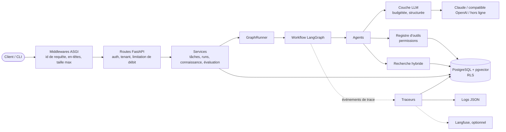
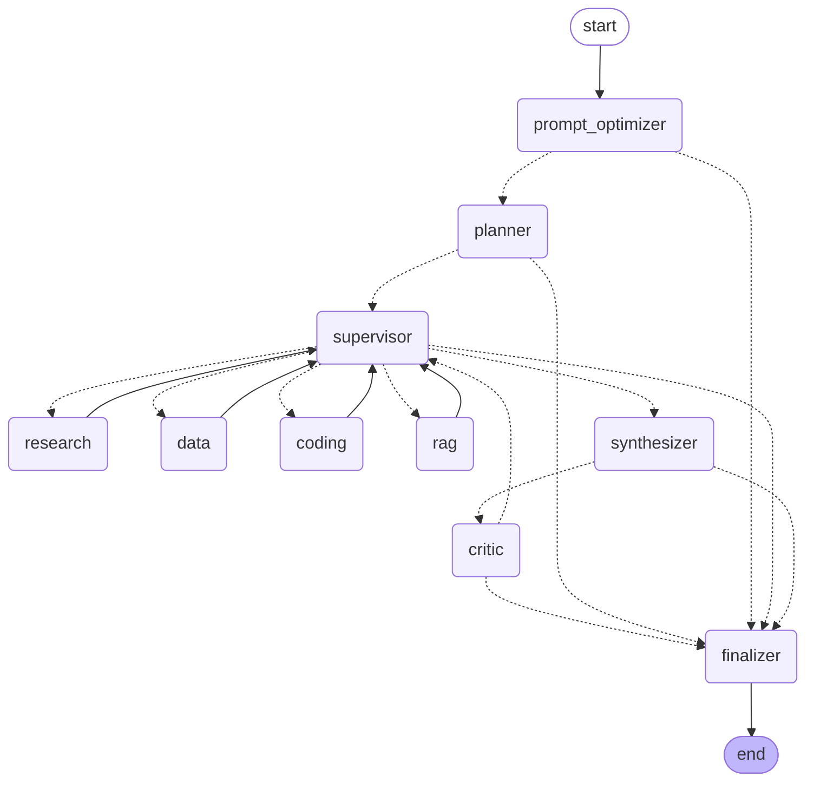
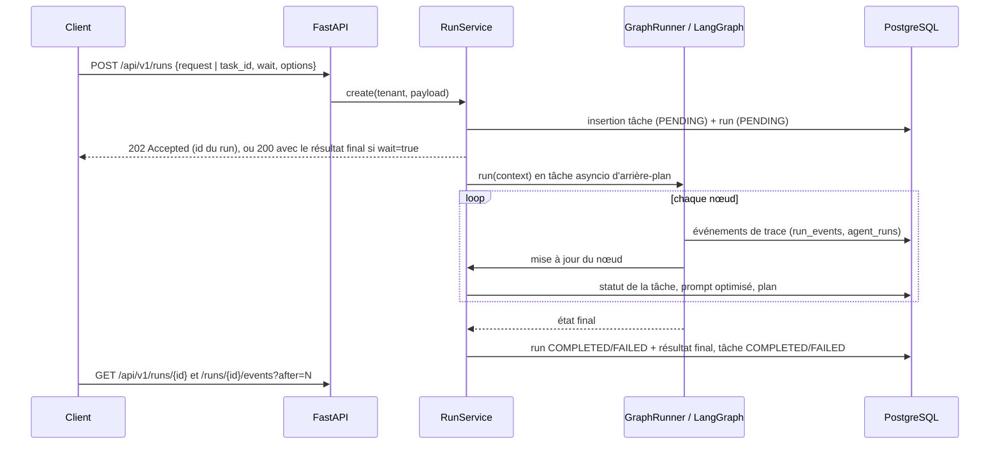

# Architecture

Ce document décrit l'assemblage de la plateforme : les composants et leurs responsabilités, le
graphe d'orchestration et son état, la communication entre agents, la gestion des erreurs et
des limites, ainsi que l'intégration de la sécurité et de l'observabilité. Les justifications
de conception se trouvent dans [decisions.md](decisions.md).

## Composants

| Paquet | Responsabilité |
|---|---|
| `app/main.py`, `app/container.py` | Fabrique d'application ; au démarrage (lifespan), un conteneur unique (racine de composition) assemble configuration, base de données, embedder, stockage de connaissances, moteur de recherche, registre d'outils, client LLM, agents et services. |
| `app/api` | Routes fines, dépendances (résolution du tenant depuis `X-API-Key`, limitation de débit par tenant), middlewares ASGI (id de requête, en-têtes de sécurité, 413 sur les corps trop gros), enveloppe d'erreur. Aucune logique métier. |
| `app/services` | Cas d'usage : `TaskService`, `RunService` (crée les runs, les exécute en arrière-plan, reflète leur progression, annulation), `KnowledgeService` (ingestion, recherche), `EvaluationService` ; `platform_data` offre aux outils de données une vue de la plateforme limitée au tenant, essentiellement en lecture. |
| `app/orchestration` | `GraphState`, le graphe, les nœuds et routeurs, les limites et le budget d'un run, le journal par run, l'exécuteur partagé par l'API, le CLI et l'évaluation. |
| `app/agents` | Catalogue des agents (missions, listes d'outils autorisés), `BaseAgent` (budget, comptage, événements, génération structurée, boucle d'outils bornée) et les neuf agents. |
| `app/llm` | Types indépendants du fournisseur, adaptateurs (Anthropic, compatible OpenAI, hors ligne), schémas JSON stricts, génération structurée avec réparation, prompts versionnés, tarification, comptage, embeddings. |
| `app/rag` | Découpage, ingestion (nettoyage, détection d'injection, embedding), stockages (PostgreSQL, mémoire), recherche hybride, reclassement. |
| `app/tools` | Contrats d'outils, registre et exécuteur qui applique les permissions, les cinq outils. |
| `app/db` | Modèles SQLAlchemy, sessions limitées au tenant, repositories ; les migrations sont dans `migrations/`. |
| `app/observability` | Événements de trace, traceurs (base, logs, Langfuse, mémoire, composite). |
| `app/evaluation` | Format du jeu de données, évaluateurs, métriques, exécuteur et CLI. |
| `app/core` | Configuration, logs et masquage des secrets, exceptions, authentification par clé d'API, limiteur de débit, garde-fous contre l'injection, utilitaires de texte. |

L'API, le CLI (`python -m app.cli`) et l'exécuteur d'évaluation construisent le contexte d'un
run de la même façon (`build_run_context`) et exécutent le même `GraphRunner` : il n'existe
qu'un seul chemin de code d'orchestration.

## Graphe d'orchestration

Généré à partir du graphe LangGraph compilé avec `uv run python -m app.cli --graph` (libellés
des nœuds de début et de fin simplifiés). Les flèches en pointillés sont des transitions
conditionnelles.

Les routeurs (`app/orchestration/router.py`) sont des fonctions pures de l'état :

| Après | Va vers | Quand |
|---|---|---|
| `prompt_optimizer` | `finalizer` | la demande a été rejetée (injection) ou le nœud a échoué |
| | `planner` | sinon |
| `planner` | `finalizer` | pas de plan valide (le nœud a échoué) |
| | `supervisor` | sinon |
| `supervisor` | un agent d'exécution | décision `dispatch` pour la prochaine étape prête |
| | `synthesizer` | toutes les étapes sont terminées, ou une relecture a échoué sans problème imputable à une étape |
| | `finalizer` | une limite est atteinte, une étape a échoué trop souvent, ou plus rien n'est exécutable |
| agent d'exécution | `supervisor` | toujours (le superviseur décide de la suite) |
| `synthesizer` | `critic` / `finalizer` | brouillon produit / nœud en échec |
| `critic` | `supervisor` | `FAIL` et `retry_count < MAX_AGENT_RETRIES` (reprise) |
| | `finalizer` | `PASS`, reprises épuisées, ou nœud en échec |

Le graphe est compilé une seule fois au démarrage. Tout ce qui est propre à un run — tenant,
budget, journal, traceur, exécuteur d'outils, suite d'agents — est transmis par le contexte
d'exécution de LangGraph (`context_schema=RunContext`), jamais capturé dans des variables
globales ou des closures.

## Cycle de vie d'un run via l'API

Le statut de la tâche suit le graphe : `PENDING` → `PLANNING` (optimiseur, planificateur) →
`RUNNING` (superviseur, agents d'exécution) → `REVIEWING` (synthétiseur, critique) →
`COMPLETED` quand la réponse est acceptée, `FAILED` sinon (rejet du critique, limite, demande
rejetée, erreur), `CANCELLED` sur `POST /runs/{id}/cancel` ou à l'arrêt du service. Le statut
du run lui-même est `COMPLETED` quand le graphe s'est terminé normalement (y compris pour une
demande rejetée, dont le statut final est `rejected`) et `FAILED` quand le statut final est
`failed`. Une tâche ne peut pas avoir deux runs actifs (`409 Conflict`).

## État

`GraphState` (`app/orchestration/state.py`) est un `TypedDict` dont les valeurs sont des
modèles Pydantic : aucun dictionnaire libre ne circule entre les nœuds. Les nœuds renvoient des
mises à jour partielles ; LangGraph les fusionne avec les réducteurs ci-dessous.

| Champ | Type | Fusion |
|---|---|---|
| `run_id`, `task_id`, `tenant_id`, `user_request`, `max_retries` | identité et entrée | fixé une fois |
| `optimized_prompt` | `PromptSpec` | remplacement |
| `plan` | `Plan` (DAG validé) | remplacement |
| `steps` | `dict[step_id, StepState]` (statut, agent, tentatives, échecs, retours, résultat) | `merge_steps` (mise à jour par clé) |
| `current_step`, `next_action` | id d'étape, `SupervisorDecision` | remplacement |
| `draft`, `review` | `FinalDraft`, `Review` (le plus récent) | remplacement |
| `rework_pending`, `abort_reason`, `final_result` | indicateurs de contrôle, `FinalResult` | remplacement |
| `messages` | journal d'`AgentMessage` (émetteur, destinataire, contenu, étape) | ajout |
| `agent_results` | chaque `AgentResult` (terminé ou en échec, avec consommation et latence) | ajout |
| `tool_results` | chaque `ToolCallRecord` (statut, arguments masqués, aperçu, latence) | ajout |
| `retrieved_documents` | `SourceRef` (étiquette stable `S1`…) | `merge_sources` (dédoublonnage par étiquette) |
| `reviews`, `errors` | chaque `Review`, chaque `RunError` | ajout |
| `retry_count` | cycles de reprise démarrés | remplacement |
| `step_count` | étapes du graphe exécutées | somme |

Statuts d'une étape : `pending` → `completed`, ou `rework` (FAIL du critique, ou étape amont
reprise) → `completed`, ou `failed` après `MAX_STEP_ATTEMPTS` échecs consécutifs.

## Communication entre agents

Les agents ne s'appellent jamais entre eux. Ils communiquent par des artefacts typés dans
l'état, et c'est le graphe qui décide qui voit quoi :

* La `PromptSpec` de l'optimiseur (objectif, exigences, livrables, contraintes, risques,
  critères d'acceptation) est le contrat de tout le run.
* Un agent d'exécution reçoit un `WorkerInput` construit par le graphe : l'objectif, **son**
  étape, les contraintes et critères d'acceptation, les résultats des étapes dont il dépend
  (résumé, points clés, identifiants de sources), les retours du critique en cas de reprise, et
  les consignes du superviseur quand la stratégie LLM est active. Il ne voit ni les autres
  étapes ni l'historique brut.
* Les chunks récupérés sont enregistrés une fois par run dans un `SourceRegistry`, qui leur
  attribue des étiquettes stables (`S1`, `S2`…). Tous les agents et la réponse finale citent la
  même étiquette pour le même chunk ; une citation d'étiquette inconnue est rejetée (agents
  d'exécution, synthétiseur) ou transformée en problème critique (critique).
* Le synthétiseur reçoit des résumés d'étapes (avec les sorties complètes), des extraits de
  sources et la demande d'origine (pour répondre dans la langue de l'utilisateur) ; le critique
  reçoit le brouillon, les résumés du plan (sans les sorties complètes), les critères
  d'acceptation et la liste des étiquettes de sources disponibles.
* `messages` conserve un journal lisible des passages de relais (`supervisor → coding: Execute
  step 'solution_design'`), utile pour relire un run après coup.

## Gestion des erreurs

| Défaillance | Traitement |
|---|---|
| Erreur du fournisseur, sortie structurée invalide après le budget de réparation, refus du modèle, erreur d'agent | Interceptée par le nœud comme erreur *récupérable*, enregistrée comme `RunError` et événement `agent_failed`. Pour une erreur HTTP du fournisseur, le run n'enregistre que le statut et le type d'erreur ; l'explication du fournisseur est journalisée côté serveur (`llm_provider_error`, masquée). Pour un agent d'exécution, le compteur d'échecs de l'étape augmente et le superviseur la relance ; après `MAX_STEP_ATTEMPTS` échecs consécutifs, le run s'arrête. Pour un nœud de contrôle (optimiseur, planificateur, synthétiseur, critique), le run passe au finalizer avec un `abort_reason`. |
| Sortie structurée invalide | Les erreurs de validation (schéma et règles métier) sont renvoyées au modèle, jusqu'à `LLM_STRUCTURED_MAX_ATTEMPTS`, chaque réparation étant tracée (`structured_output_repaired`). |
| Erreur, refus ou dépassement de délai d'un outil | Renvoyé au modèle comme résultat d'outil en erreur (il peut s'adapter), enregistré avec le statut `error` ou `denied`. Les exceptions internes sont remplacées par un message générique (aucune trace de pile ni requête SQL ne parvient au modèle). |
| Budget dépassé (`max_agent_calls`, `max_runtime`, `max_cost`) | Vérifié avant chaque appel d'agent et de LLM (`BudgetExceededError`) ; le superviseur détecte le dépassement et finalise avec la limite comme raison (événement `limit_reached`). Non compté comme échec d'étape. |
| Le critique rejette la réponse | Reprise ciblée, au plus `MAX_AGENT_RETRIES` cycles ; ensuite le run se termine en `failed` avec le dernier brouillon, la dernière relecture et un avertissement. |
| Exception inattendue (un bug), limite de récursion, délai maximal absolu | L'exécuteur émet `run_failed` et lève `RunAbortedError` ; le service marque le run et la tâche `FAILED`. Les bugs ne sont pas avalés. |
| Annulation | La tâche asyncio est annulée ; run et tâche passent en `CANCELLED`, `run_cancelled` est émis avec les métriques à cet instant. |
| Erreurs d'API | Une enveloppe unique `{"error": {code, message, details, request_id}}`. Les erreurs de validation ne renvoient jamais l'entrée ; les erreurs non gérées renvoient un 500 générique avec l'id de requête. |

## Limites

Toutes les limites sont des paramètres (`.env`) appliqués deux fois : en douceur par le
superviseur (qui finalise avec une raison explicite) et strictement à chaque appel d'agent et
de LLM (aucune boucle d'outils, de réparation ou de reprise ne peut donc les dépasser).

| Paramètre | Défaut | Portée |
|---|---|---|
| `MAX_AGENT_STEPS` | 40 | étapes du graphe par run (`recursion_limit` de LangGraph = cette valeur + 10, en dernier recours) |
| `MAX_AGENT_CALLS` | 16 | appels d'agents par run |
| `MAX_AGENT_RETRIES` | 2 | cycles de reprise du critique |
| `MAX_STEP_ATTEMPTS` | 2 | échecs consécutifs d'une étape |
| `MAX_TOOL_CALLS_PER_AGENT` | 6 | appels d'outils par appel d'agent (les suivants sont refusés) |
| `MAX_PLAN_STEPS` | 6 | étapes dans un plan |
| `MAX_RUN_SECONDS` | 300 | durée d'un run (délai asyncio absolu à +30 s) |
| `MAX_RUN_COST_USD` | 2.0 | coût LLM estimé par run (tokens × grille tarifaire) ; un modèle sans tarif intégré exige `LLM_PRICE_*`, sinon le démarrage échoue plutôt que de compter les appels à 0 $ |
| `MAX_CONCURRENT_RUNS` | 4 | runs simultanés par processus API |
| `CRITIC_PASS_THRESHOLD` | 70 | score minimal du critique pour `PASS` |

## Sécurité

La sécurité est organisée en couches ; chacune suppose que la précédente peut céder. Résumé
ci-dessous, détails dans [security.md](security.md).

* **Entrée** : les clés d'API (empreintes SHA-256, comparaison à temps constant) désignent un
  tenant ; limitation de débit par seau à jetons et par tenant ; modèles de requête stricts
  (`extra="forbid"`, limites de taille) ; 413 sur les corps trop gros ; en-têtes de sécurité.
* **Données** : chaque requête filtre sur le tenant et la sécurité au niveau des lignes (RLS)
  de PostgreSQL est activée et forcée sur toutes les tables, avec un rôle applicatif non
  superutilisateur (fermée par défaut).
* **Entrées du modèle** : détection d'injection sur les demandes (risque élevé → rejet avant
  tout appel LLM) et sur chaque chunk ingéré (risque élevé → exclu à la recherche) ; le contenu
  non fiable est transmis en JSON échappé dans `<context>`, avec une règle explicite « données,
  pas instructions ».
* **Actions** : listes d'outils autorisés par agent, outils d'écriture masqués et refusés sans
  autorisation explicite au niveau du run, arguments validés, délais maximaux, sorties
  tronquées ; ni shell, ni système de fichiers, ni SQL brut, ni exécution de code.
* **Sorties** : validation de schéma, vérification des citations, politique du critique.
* **Secrets** : paramètres en `SecretStr`, jamais journalisés ; masquage dans les logs, les
  événements de run et Langfuse.

## Observabilité

Chaque agent et l'exécuteur émettent des `TraceEvent` typés ; un `CompositeTracer` les diffuse
vers les destinations configurées et isole leurs défaillances (une destination en panne ne fait
jamais échouer un run).

| Événement | Contenu principal |
|---|---|
| `run_started` / `run_completed` / `run_failed` / `run_cancelled` | limites, statut final, acceptation, raison d'arrêt, métriques |
| `prompt_optimized`, `plan_created` | spécification, étapes du plan, dépendances, ordre topologique |
| `supervisor_decision` | action, agent cible, étape, raison, stratégie, proposition LLM rejetée |
| `agent_started` / `agent_completed` / `agent_failed` | agent, étape, tentative, latence, appels LLM, tokens, modèle, version de prompt, sortie |
| `llm_call` | fournisseur, modèle, nom et version du prompt, raison d'arrêt, tokens (dont lectures/écritures de cache), latence, coût, outils demandés, id de requête du fournisseur |
| `structured_output_repaired` | agent, tentative, erreurs de validation |
| `tool_call` / `tool_denied` | outil, agent, étape, statut, arguments masqués, latence, aperçu de la sortie |
| `retrieval` | requête, résultats étiquetés avec scores, chunks écartés, latence |
| `guardrail_triggered` | garde-fou, cible, risque, signaux, action (`blocked`, `flagged`, `excluded`) |
| `critic_verdict`, `rework_requested`, `limit_reached` | statut, score, tour, problèmes, étapes signalées et en cascade, raison |

Destinations :

* **PostgreSQL** (`DatabaseTracer`) : chaque événement dans `run_events` (ordonné par une
  séquence propre au run, servi par `GET /api/v1/runs/{id}/events?after=N`), plus une ligne
  `agent_runs` par appel d'agent (agent, étape, tentative, statut, modèle, version de prompt,
  tokens, latence, erreur). Les contenus sont masqués et de taille bornée.
* **Logs** (`LoggingTracer`) : lignes JSON portant `request_id`, `run_id`, `task_id` et
  `tenant_id` depuis des variables de contexte ; lignes d'accès HTTP émises par le middleware.
* **Langfuse** (optionnel) : une trace par run avec des observations de type chaîne, agent,
  génération, outil, recherche, garde-fou et évaluateur, ainsi qu'un `critic_score`.

Métriques d'un run (`FinalResult.metrics`) : étapes du graphe, appels d'agents, appels LLM,
appels d'outils, cycles de reprise, tokens en entrée, en sortie et en cache, coût estimé,
durée.

## Modèle de données

| Table | Contenu | Contraintes et index notables |
|---|---|---|
| `tasks` | demande de l'utilisateur, prompt optimisé, statut, résultat, erreur, métadonnées | contrôle du statut ; `(tenant_id, created_at DESC)`, `(tenant_id, status)` |
| `runs` | tâche, statut, options, plan, relecture, résultat final, erreur, compteurs (étapes, appels d'agents, reprises, tokens, coût), heures de début et de fin | contrôle du statut ; `(tenant_id, task_id)`, `(tenant_id, created_at DESC)` |
| `run_events` | journal d'événements en ajout seul : séquence, type, nœud, agent, étape, contenu | unique `(run_id, sequence)` ; `(tenant_id, event_type)` |
| `agent_runs` | une ligne par appel d'agent : étape, tentative, statut, entrée, sortie, erreur, modèle, version de prompt, tokens, latence | `(run_id)`, `(tenant_id, agent)` |
| `documents` | titre, source, contenu nettoyé, SHA-256, métadonnées, nombre de chunks | unique `(tenant_id, content_sha256)` (ingestion idempotente) |
| `document_chunks` | contenu, `vector(512)`, `tsvector` généré, métadonnées, nombre de tokens | HNSW cosinus, GIN plein texte, GIN `jsonb_path_ops` sur les métadonnées, unique `(document_id, chunk_index)` |
| `evaluations` | jeu de données, statut, configuration, synthèse, résultats par cas | `(tenant_id, created_at DESC)` |

Chaque table a une colonne `tenant_id`, la sécurité au niveau des lignes activée et forcée, et
la politique `tenant_isolation`. Le schéma est créé par la migration Alembic
`migrations/versions/0001_initial_schema.py`.
