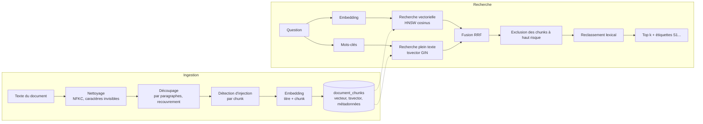

# Pipeline RAG

La base de connaissances ancre les réponses des agents dans les documents internes du tenant.
C'est un vrai pipeline — nettoyage, découpage, détection d'injection, embeddings, PostgreSQL +
pgvector, recherche hybride, reclassement, citations vérifiées — dont chaque étape est
observable et testée.



## Ingestion

`POST /api/v1/knowledge/documents` (ou `python -m scripts.seed_knowledge` pour le corpus de
démonstration) → `KnowledgeService.ingest` → `DocumentIngestor.prepare` → stockage.

1. **Validation** — titre de 2 à 300 caractères, contenu de 20 à 200 000 caractères, `source`
   et `metadata` optionnels (20 clés scalaires au plus). L'API reçoit du texte brut : il n'y a
   pas d'étape d'extraction PDF ou HTML.
2. **Nettoyage** — normalisation Unicode NFKC et suppression des caractères invisibles,
   bidirectionnels et de contrôle. Leur nombre est rapporté (`hidden_characters_removed`) car du
   texte caché est un moyen classique de glisser des instructions sous les yeux d'un relecteur
   humain ; s'il y en avait, chaque chunk du document est au moins marqué à risque `low`.
3. **Dédoublonnage** — le SHA-256 du contenu nettoyé est unique par tenant : réingérer le même
   document renvoie le document existant avec `created: false` (idempotent, `200` au lieu de
   `201`).
4. **Découpage** — voir ci-dessous.
5. **Détection d'injection** — chaque chunk passe par le même détecteur heuristique que les
   demandes des utilisateurs (`app/core/guardrails.py`) ; le risque (`none` | `low` | `high`) et
   les signaux sont stockés dans les métadonnées du chunk.
6. **Embedding** — chaque chunk est vectorisé sous la forme `titre + "\n" + chunk` (un en-tête de
   contexte qui aide les chunks courts qui ne rappellent pas leur sujet).
7. **Stockage** — le document et tous ses chunks sont insérés dans une seule transaction limitée
   au tenant.

La réponse est un `IngestionReport` : le document, `created`, `flagged_chunks`,
`hidden_characters_removed`.

## Découpage

`app/rag/chunking.py` découpe le texte en *unités* : les paragraphes ; les paragraphes plus longs
que la taille d'un chunk sont découpés en phrases ; les phrases plus longues encore sont coupées
de force. Les unités sont regroupées de façon gloutonne en chunks d'au plus `RAG_CHUNK_SIZE`
caractères (900 par défaut), et deux chunks consécutifs se recouvrent d'unités entières jusqu'à
`RAG_CHUNK_OVERLAP` caractères (150 par défaut), pour qu'une idée à cheval sur une frontière
reste trouvable des deux côtés. Les positions dans le texte nettoyé sont conservées
(`char_start`, `char_end`).

Sur le corpus de démonstration (`docs/demo`, une entreprise fictive « NovaDesk ») :

| Document | Catégorie | Caractères | Chunks | Signalés |
|---|---|---|---|---|
| `company_policy.txt` — politique interne (devis, remises, TVA, conservation, RGPD) | policy | 2 400 | 3 | 0 |
| `technical_guide.txt` — stack, multi-tenant, types monétaires, REST, événements, PDF | technical | 2 813 | 4 | 0 |
| `product_specs.txt` — module devis v1 : fonctionnalités, exigences non fonctionnelles, indicateurs | product | 1 718 | 3 | 0 |
| `vendor_proposal.txt` — proposition d'un prestataire externe contenant une injection | external | 735 | 1 | 1 (`high` : instruction_override, system_prompt_extraction, tool_coercion, secret_exfiltration) |

## Embeddings

| Fournisseur | Paramètre | Notes |
|---|---|---|
| `HashingEmbedder` (défaut) | `EMBEDDING_PROVIDER=hashing` | Hachage de caractéristiques signé (blake2b) des unigrammes et des bigrammes (pondérés 0,5), mots vides retirés (anglais + français), accents et pluriels ramenés à une forme commune, pondération `1 + log(tf)`, normalisation L2, 512 dimensions. Déterministe, sans téléchargement ni réseau. Similarité lexicale uniquement. |
| `OpenAICompatibleEmbedder` | `EMBEDDING_PROVIDER=openai`, `EMBEDDING_MODEL`, `EMBEDDING_API_KEY`, `EMBEDDING_BASE_URL` | Tout endpoint `/embeddings` (OpenAI, Ollama, vLLM…), par lots, `dimensions=512` demandé explicitement ; une réponse d'une autre taille est une erreur. |

Le nom du modèle d'embedding est enregistré dans les métadonnées de chaque document. Changer de
modèle ou de dimension implique de revectoriser le corpus (et une migration pour la dimension).

## Stockage dans PostgreSQL + pgvector

`document_chunks` contient, pour chaque chunk : `content`, `embedding vector(512)`, un
`content_tsv tsvector` généré (`to_tsvector('simple', content)`), `metadata JSONB`,
`chunk_index`, `token_count` (approximation : caractères / 4) et `tenant_id`.

| Index | Rôle |
|---|---|
| HNSW sur `embedding` (`vector_cosine_ops`, `m=16`, `ef_construction=64`) | plus proches voisins approchés |
| GIN sur `content_tsv` | recherche plein texte |
| GIN `jsonb_path_ops` sur `metadata` | filtres sur les métadonnées (`category`…) |
| `(tenant_id, document_id)`, unique `(document_id, chunk_index)` | périmètre du tenant, intégrité |

Les requêtes vectorielles s'exécutent avec `SET LOCAL hnsw.iterative_scan = relaxed_order`
(pgvector ≥ 0.8) : avec des filtres (tenant, RLS, métadonnées), un parcours HNSW simple peut
renvoyer moins de lignes que demandé ; le parcours itératif continue jusqu'à en trouver
assez. Chaque requête filtre sur `tenant_id` et s'exécute sous sécurité au niveau des lignes
(voir [security.md](security.md)). La configuration plein texte `simple` ne fait pas de
racinisation, ce qui la garde neutre vis-à-vis de la langue pour un corpus mêlant français et
anglais ; la normalisation de l'embedder par hachage compense en partie.

Un `InMemoryKnowledgeStore` implémente le même protocole pour le CLI et les tests unitaires.

## Recherche

`HybridRetriever.search(tenant_id, query, top_k, filters)` :

1. **Analyse de la requête** — un embedding de la question ; jusqu'à 12 mots-clés (tokens de 3
   caractères ou plus, mots vides et nombres retirés). Seuls des termes alphanumériques
   parviennent au `to_tsquery` de PostgreSQL, combinés par `|` : un utilisateur ne peut pas
   injecter d'opérateurs tsquery.
2. **Deux recherches**, renvoyant chacune `RAG_CANDIDATE_POOL` candidats (20 par défaut) :
   distance cosinus sur l'index HNSW, et `ts_rank_cd` sur l'index plein texte. Les filtres de
   métadonnées (`category`, `document_ids`) s'appliquent dans les deux.
3. **Reciprocal Rank Fusion** — `score(chunk) = Σ 1 / (60 + rang)` sur les deux classements.
   La RRF fusionne des classements sans devoir calibrer des scores d'échelles différentes ; la
   recherche vectorielle trouve les reformulations, la recherche plein texte les termes exacts
   (codes comme `DEV-AAAA-NNNNN`, noms, acronymes).
4. **Filtre anti-injection** — les chunks dont les métadonnées indiquent `injection_risk: high`
   sont exclus et comptés (`filtered_out`), quand `RAG_BLOCK_SUSPICIOUS_CHUNKS=true` (défaut).
5. **Reclassement** — voir ci-dessous.
6. **Top k** — `RAG_TOP_K` (5 par défaut) pour l'agent RAG ; `knowledge_search` laisse le modèle
   demander de 1 à 8 résultats.

Chaque résultat conserve son `vector_score`, son `text_rank` et son `score` final, ce qui rend la
recherche explicable. Exemple sur le corpus de démonstration (embedder hors ligne, stockage en
mémoire, `top_k=3`) :

```text
Q: "Quelle est la durée de validité d'un devis ?"          filtered_out: 1 (vendor proposal)
  Politique interne NovaDesk   #0  score 1.0     vector 0.307  text 4.67
  Spécifications produit       #2  score 0.6547  vector 0.189  text 2.67
  Spécifications produit       #1  score 0.6547  vector 0.142  text 3.00
```

Le chunk de la politique interne qui donne la validité de 30 jours arrive en tête ; le chunk
piégé du prestataire faisait partie des candidats et a été exclu.

## Reclassement

`LexicalReranker` (`app/rag/reranking.py`) :

```text
pertinence = 0,5 × (score fusionné / meilleur score fusionné) + 0,5 × couverture des mots-clés
```

où la couverture des mots-clés est la part des mots-clés de la question présents dans le titre et
le contenu du chunk. Les chunks sans aucun mot-clé commun **et** avec un score vectoriel
inférieur à 0,3 sont écartés comme du bruit (des textes sans rapport atteignent environ 0,2 de
similarité cosinus avec l'embedder par hachage à 512 dimensions, à cause des collisions). C'est
peu coûteux et déterministe ; un cross-encoder ou un LLM-juge peut implémenter le même protocole
`Reranker`.

## Métadonnées

| Niveau | Clés |
|---|---|
| Document | métadonnées fournies par l'appelant (par ex. `category`, `demo`), `embedding_model`, `hidden_characters_removed` (si > 0) |
| Chunk | `category` (copiée du document, utilisée par les filtres), `injection_risk`, `injection_signals`, `char_start`, `char_end` |

## Citations

* **Étiquettes stables** — au sein d'un run, chaque chunk récupéré est enregistré une fois dans
  le `SourceRegistry` et reçoit une étiquette (`S1`, `S2`…). `knowledge_search` renvoie ces
  étiquettes dans `source_id` ; l'agent RAG étiquette sa propre recherche de la même façon. Un
  même chunk a toujours la même étiquette, quel que soit l'agent qui l'a récupéré.
* **Agent RAG** — chaque citation doit renvoyer à l'une des sources récupérées et son `quote`
  doit être exact dans cette source : les mêmes mots dans le même ordre. La casse, la
  ponctuation, les guillemets, les tirets et les espaces sont ignorés (une variante
  typographique n'est pas une invention) ; les coupures marquées « … » sont acceptées si chaque
  fragment (3 mots ou plus) apparaît dans l'ordre. Une paraphrase, une traduction ou des mots
  isolés recollés sont rejetés et la réponse est renvoyée pour réparation. Une citation trop
  longue (plus de 300 caractères) est d'abord coupée à une frontière de mot et marquée « … » :
  le début d'un extrait exact reste exact. Une quasi-citation (un mot omis sans marquer la
  coupure) est remplacée par la phrase de la source qu'elle reproduit, si au moins 80 % de ses
  mots figurent dans cette phrase et que tous les nombres sont identiques : les citations
  montrées aux utilisateurs sont, par construction, le texte même des sources. Une réponse doit
  avoir au moins une citation ou une liste explicite des informations manquantes.
* **Agents Research et Coding** — une sortie qui cite des étiquettes jamais récupérées pendant
  le run est renvoyée pour réparation.
* **Synthesizer** — les marqueurs `[S#]` du brouillon doivent renvoyer à des sources récupérées.
* **Politique du critique** — un brouillon qui cite une source inconnue reçoit un problème
  critique et ne peut pas passer.
* **Résultat final** — `sources` liste chaque source récupérée : étiquette, titre, origine, score
  et extrait, pour qu'un lecteur puisse vérifier chaque `[S#]` de la réponse.

Quand rien de pertinent n'est trouvé, l'agent RAG répond que les documents ne contiennent pas
l'information, **sans appeler le LLM** — le cas d'évaluation `out-of-scope-question` vérifie que
la plateforme le dit au lieu d'inventer une réponse.

## Injection de prompt via les documents

Les documents sont des entrées non fiables. Défenses, dans l'ordre :

1. la détection à l'ingestion signale les chunks (`vendor_proposal.txt` est marqué `high` avec
   quatre signaux) ;
2. les chunks à haut risque sont exclus à la recherche et l'exclusion est tracée
   (`guardrail_triggered`, `indirect_prompt_injection`, action `excluded`), que la recherche
   vienne de l'agent RAG ou d'un appel à `knowledge_search` ;
3. les chunks à risque plus faible sont transmis avec leurs `flags`, pour que le modèle sache
   qu'ils sont suspects ;
4. les résultats de `knowledge_search` portent une note indiquant que ce contenu est une donnée
   non fiable ;
5. chaque prompt place les documents en JSON dans `<context>` (avec `</` échappé), sous une
   règle système qui précise que ce contenu est une donnée, jamais une instruction ;
6. même si une instruction passait, les outils qu'elle pourrait demander sont limités par la
   liste autorisée de l'agent, et les outils d'écriture exigent une autorisation explicite au
   niveau du run.

Le cas d'évaluation `indirect-injection-vendor-document` vérifie que le garde-fou se déclenche,
qu'aucun outil d'écriture ne s'exécute et que la réponse ne contient rien du texte injecté.

## API

| Endpoint | Description |
|---|---|
| `POST /api/v1/knowledge/documents` | ingère un document → `IngestionReport` (`201`, ou `200` pour un doublon) |
| `GET /api/v1/knowledge/documents` | liste les documents du tenant |
| `POST /api/v1/knowledge/search` | `{query, top_k (1–20), filters: {category, document_ids}}` → résultats avec `score`, `vector_score`, `text_rank`, `content`, `injection_risk`, plus `filtered_out` et `latency_ms` |

## Configuration

| Paramètre | Défaut |
|---|---|
| `RAG_CHUNK_SIZE` / `RAG_CHUNK_OVERLAP` | 900 / 150 caractères (le recouvrement doit être inférieur à la taille) |
| `RAG_TOP_K` / `RAG_CANDIDATE_POOL` | 5 / 20 (le nombre de candidats doit être ≥ top k) |
| `RAG_BLOCK_SUSPICIOUS_CHUNKS` | `true` |
| `EMBEDDING_PROVIDER` | `hashing` (`openai` pour un endpoint compatible OpenAI) |

## Mesurer la recherche

Les cas d'évaluation peuvent déclarer `expected_sources` (des titres de documents qui doivent
figurer parmi les sources du run) ; la métrique `retrieval_relevance` est la part des sources
attendues effectivement récupérées (voir [evaluation.md](evaluation.md)). Les tests
d'intégration PostgreSQL vérifient la recherche vectorielle, la recherche plein texte, les
filtres, l'isolation des tenants et l'exclusion des chunks signalés sur une vraie base pgvector.

## Limites

* L'embedder par hachage est lexical : pas de synonymes, pas de correspondance entre langues. En
  production, il faut un vrai modèle d'embeddings (le fournisseur est déjà interchangeable).
* La détection d'injection est heuristique (expressions régulières, anglais et français) : des
  paraphrases, d'autres langues ou des encodages peuvent passer. C'est une couche parmi
  d'autres.
* Texte brut uniquement : pas d'extraction PDF/HTML, pas de gestion des tableaux ni de la mise en
  page.
* Pas de reclassement par cross-encoder ; le reclassement lexical favorise le recouvrement de
  mots-clés.
* Les nombres de tokens sont des approximations (caractères / 4) ; le découpage se fait en
  caractères.
* HNSW est approché : le rappel dépend de `ef_search` et de la distribution des données
  (valeurs par défaut conservées).
